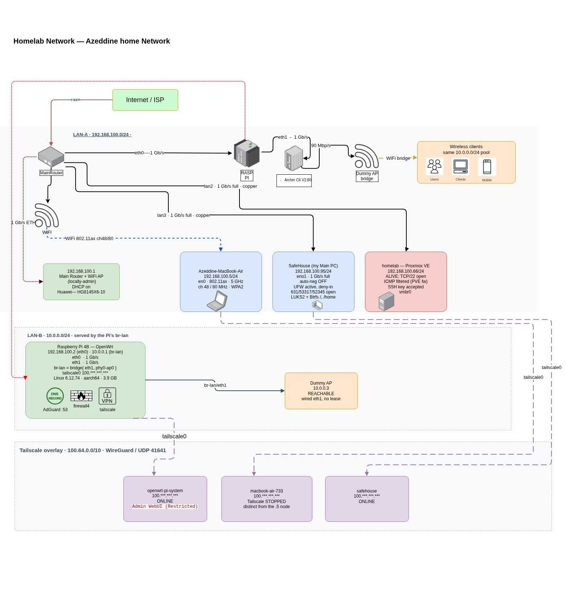

# 🛡️ Dual-Zone Homelab & Home Routing Infrastructure (v2)

[](https://proxmox.com)
[--Linux-blue?logo=archlinux&logoColor=white)](https://cachyos.org)
[-00D7D7?logo=openwrt&logoColor=white)](https://openwrt.org)
[](#)
[](#)
[](#)
[-1E293B?logo=tailscale&logoColor=white)](https://tailscale.com)


<p align="center">
  
</p>


Welcome to the documentation of my production homelab, Home dual-zone routing, and virtualization environment. This repository details the physical architecture, subnets, firewall rules, and zero-trust mesh topologies I designed and maintain for continuous hands-on learning in **IT System Administration**.

---

## 🗺️ Network Topology

```
                                  [ WAN / Optical Fiber ]
                                             │
                        ┌────────────────────┴────────────────────┐
                        │       Main Router + Wi-Fi 6 AP          │
                        │       Huawei HG8145X6-10 Gateway        │
                        │          192.168.100.1 / DHCP           │
                        └────────────────────┬────────────────────┘
                                             │
               ┌─────────────────────────────┼─────────────────────────────┐
               │ 1 Gb/s Copper               │ 1 Gb/s Copper               │ Wi-Fi 6 (802.11ax)
               ▼                             ▼                             ▼
    ┌──────────────────────┐      ┌──────────────────────┐      ┌──────────────────────┐
    │  Personal Workstation│      │  Virtualization Node │      │  Mobile Workstation  │
    │  SafeHouse (CachyOS) │      │  homelab (Proxmox VE)│      │  MacBook Air (M3)    │
    │  192.168.100.95/24   │      │  192.168.100.66/24   │      │  192.168.100.5/24    │
    │  • eno1: 1 Gb/s full │      │  • vmbr0 Linux bridge│      │  • en0: Ch 48/80 MHz │
    │  • LUKS2 + Btrfs     │      │  • TCP/22 SSH open   │      │  • WPA2 / 5 GHz      │
    │  • UFW: 631/53317 open│     │  • PVE firewall / nft│      └──────────┬───────────┘
    └──────────┬───────────┘      └──────────────────────┘                 │
               │                                                           │
               │                      1 Gb/s Eth0 Uplink                   │
               └──────────────────────────────┬────────────────────────────┘
                                              ▼
                             ┌─────────────────────────────────┐
                             │  Raspberry Pi 4B (OpenWrt)      │
                             │  WAN: 192.168.100.2 (eth0)      │
                             │  LAN: 10.0.0.1 (br-lan/eth1)    │
                             │  • Linux 6.12.74 aarch64 (3.9G) │
                             │  • AdGuard Home DNS (:53)       │
                             │  • OpenWrt firewall4 (nftables) │
                             │  • Tailscale Gateway node       │
                             └────────────────┬────────────────┘
                                              │
                                              │ 1 Gb/s Eth1 Trunk
                                              ▼
                             ┌─────────────────────────────────┐
                             │  Archer C6 v2.80 (Dummy AP)     │
                             │  10.0.0.3 / Layer-2 Bridge      │
                             │  f0:09:0d:6f:9b:14              │
                             └────────────────┬────────────────┘
                                              │
                                              │ Wi-Fi Bridge
                                              ▼
                             ┌─────────────────────────────────┐
                             │  Isolated Client Zone (LAN-B)   │
                             │  Pool: 10.0.0.0/24              │
                             │  • Mobile Clients               │
                             │  • Users & Guest Devices        │
                             └─────────────────────────────────┘

═══════════════════════════════════════════════════════════════════════════════════════════════
   🔐 OVERLAY NETWORK: Tailscale Mesh (100.64.0.0/10 WireGuard / UDP 41641)
   • SafeHouse:        100.***.***.*** (ONLINE, fd7a:115c:a1e0::a032:eb6b)
   • OpenWrt Gateway:  100.***.***.*** (ONLINE, TCP/1995 management port)
   • MacBook Air M3:   100.***.***.*** (Configured client node)
═══════════════════════════════════════════════════════════════════════════════════════════════
```

---

## 🏛️ Node Inventory & Hardware Specifications

| Node / Hostname | IP / Subnet | OS / Firmware | Hardware / Role | Security & Storage Features |
| :--- | :--- | :--- | :--- | :--- |
| **Main Gateway** | `192.168.100.1/24` | Huawei VOS | **Huawei HG8145X6-10** (GPON ONT + Wi-Fi 6 AP) | Fiber WAN Termination, DHCP Server, Primary NAT |
| **SafeHouse** | `192.168.100.95/24` | **CachyOS** (Linux 7.2.2 Arch) | **AMD Ryzen 7 7700X** · 30 GB RAM · RX 6800 XT | **LUKS2** Full-Disk Encryption, **Btrfs** root/home subvols, **UFW** active (default deny-in, ports 631/53317/52345 open) |
| **homelab** | `192.168.100.66/24` | **Proxmox VE 9.2.20** (Debian 13) | **Intel Core i7-1165G7** · 31 GB RAM · 256GB NVMe | **vmbr0** bridge, PVE firewall (nftables, ICMP filtered), TCP/22 SSH key authentication, LVM-thin |
| **OpenWrt Edge** | `192.168.100.2` (WAN)<br>`10.0.0.1` (LAN) | **OpenWrt** (Linux 6.12.74 aarch64) | **Raspberry Pi 4B** (4 GB RAM, dual NIC: eth0 + eth1) | **AdGuard Home** (:53 DNS sinkhole), **firewall4** (nftables), `br-lan = bridge{eth1, phy0-ap0}`, Tailscale gateway |
| **Archer C6** | `10.0.0.3/24` | TP-Link Vendor FW | **Archer C6 v2.80** (Operating in Access Point Bridge mode) | MAC `f0:09:0d:6f:9b:14`, broadcasts isolated client Wi-Fi for `10.0.0.0/24` |
| **MacBook Air** | `192.168.100.5/24` | **macOS** (Darwin 25 arm64) | **Apple M3 (2024)** · 16 GB Unified Memory | Connected via `en0` (802.11ax, 5 GHz, Ch 48 / 80 MHz, WPA2), Tailscale client |

---

## 🛡️ Network Architecture & Security Highlights

### 1. Dual-Zone Network Segmentation (LAN-A & LAN-B)
* **LAN-A (`192.168.100.0/24`): High-Trust Infrastructure Backbone**
  * Connects the Huawei GPON gateway, the **CachyOS workstation (SafeHouse)**, the **Proxmox VE hypervisor**, the **MacBook Air M3**, and the WAN interface (`eth0`) of the Raspberry Pi.
  * Direct 1 Gb/s full-duplex copper Ethernet links ensure minimum latency and maximum bandwidth for hypervisor management and local storage replication.
* **LAN-B (`10.0.0.0/24`): Isolated Client & User Zone**
  * Handled completely by the **Raspberry Pi 4B running OpenWrt**.
  * The physical `eth1` port trunks downstream to the **TP-Link Archer C6 v2.80**, which acts as a dedicated Layer-2 access point bridge.
  * Mobile phones, guest tablets, and IoT devices are physically segregated from hypervisor management interfaces.

### 2. Network-Wide DNS Sinkholing (AdGuard Home)
* AdGuard Home runs directly on the OpenWrt Raspberry Pi (`:53`), serving as the upstream authoritative resolver for LAN-B and internal DNS overrides.
* Provides network-wide telemetry blocking, tracking protection, and custom split-horizon DNS routing (`.home` / `.lan` domain resolution) without client-side software.

### 3. Layered Host Defense (UFW & PVE Firewall)
* **SafeHouse Workstation:** Hardened with **UFW** enforcing an incoming default DENY policy. Only strictly whitelisted ports (CUPS 631, internal P2P ports) are reachable.
* **Proxmox VE Node:** Protected by Proxmox's native **pve-firewall (nftables)** engine. ICMP ping is filtered, and administrative access is restricted to authenticated Ed25519 SSH keys and encrypted HTTPS WebUI (:8006).

### 4. Zero-Trust Overlay Mesh (Tailscale WireGuard)
* Enrolled nodes operate on the `100.64.0.0/10` CGNAT range over encrypted WireGuard (UDP 41641).
* Allows seamless, end-to-end encrypted remote management from mobile devices outside the local LAN without port forwarding or exposing internal IP addresses to the public internet.

---

## 💡 Alignment with German IHK Curriculum (FISI Lernfelder)


---

*Authored and maintained by Azeddine Taleb Ahmed · Last updated: October 2026*
